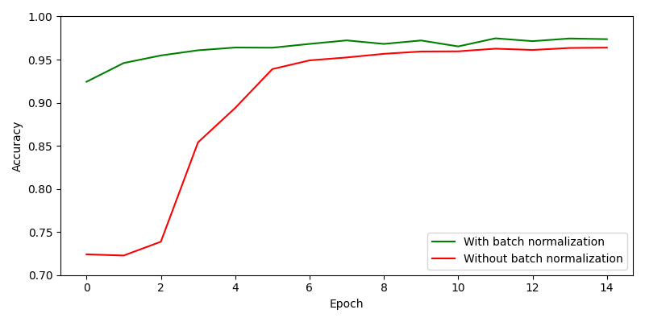
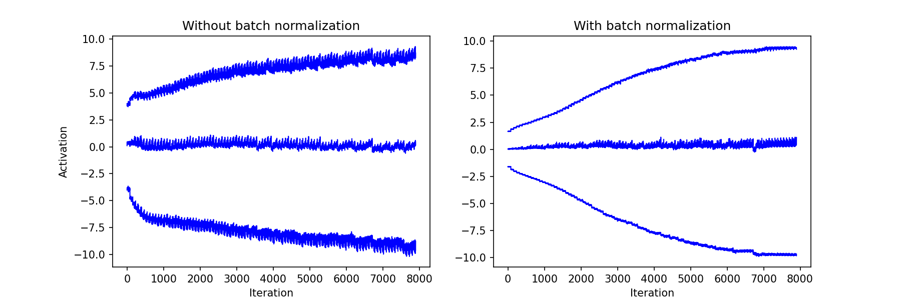

<!--
mlpi
title: Batch Normalization: Accelerating Deep Network Training by Reducing Internal Covariate Shift
category: Techniques
images: results/mnist/accuracies.png, results/mnist/activations.png
--> 

<h1 align="center">Batch Normalization</h1>
PyTorch implementation of batch normalization from "Batch Normalization: Accelerating Deep Network Training by Reducing Internal Covariate Shift" by Sergey Ioffe, Christian Szegedy.

## Results

On the MNIST dataset, batch normalization (BN) not only helped the model converge faster, but also allowed it to achieve
a greater accuracy, which is consistent with the findings in [1].

 

The input distribution to the sigmoid activation function in the last (3rd) hidden layer was probed during each iteration.
In bottom-up order, the 15th, 50th, and 85th percentiles of the input distribution over all iterations are plotted below:

BN makes the distribution far more stable, which helps the model converge faster during training.
In the above plots, the BN model's distribution converges and plateaus quickly, whereas the non-BN model's distribution
has yet to reach that point.

## References
[[1](https://arxiv.org/abs/1502.03167)] Sergey Ioffe, Christian Szegedy. *Batch Normalization: Accelerating Deep Network Training by Reducing Internal Covariate Shift*.
arXiv:1502.03167v3 [cs.LG] 2 Mar 2015
